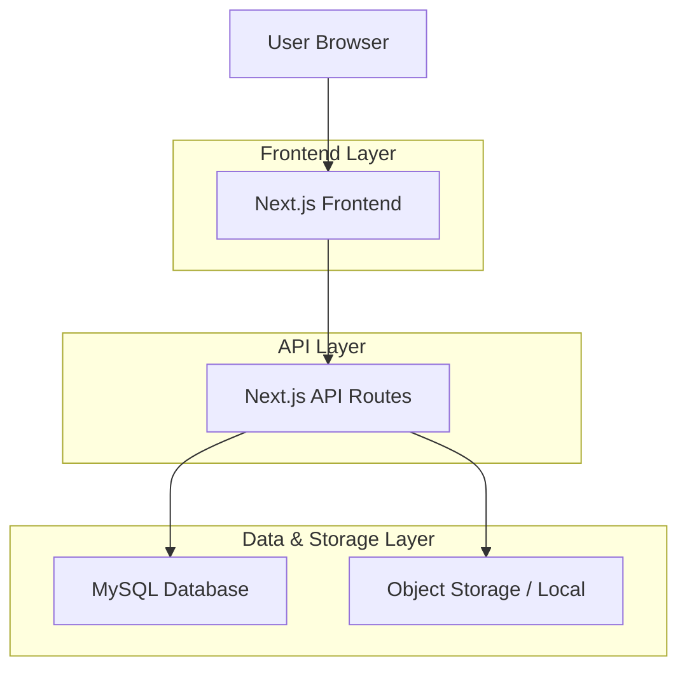
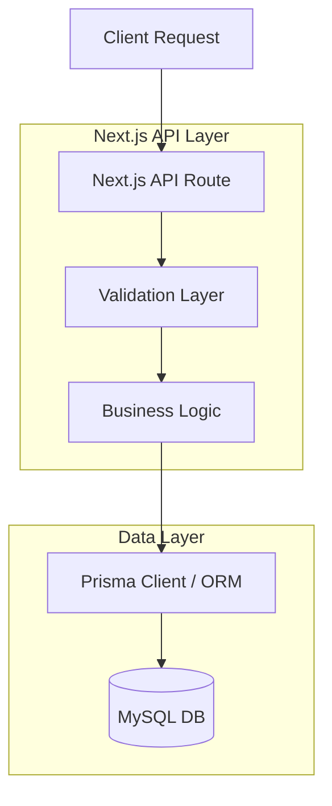
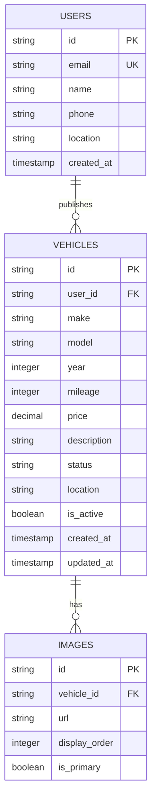

## 1. Architecture design



## 2. Technology Description

- **Frontend**: Next.js@14 + React@18 + TypeScript
- **Styling**: Tailwind CSS@3
- **Backend**: Next.js API Routes (REST)
- **Database**: MySQL 8.0+
- **Storage**: Local Filesystem or Object Storage (AWS S3, Cloudinary)
- **ORM**: Prisma (Recommended for MySQL) or MySQL2 driver
- **Initialization Tool**: create-next-app

## 3. Route definitions

| Route | Purpose |
|-------|---------|
| `/` | Home page with search and featured vehicles |
| `/vehicles/[id]` | Vehicle detail page with optimized SEO |
| `/publish` | Vehicle submission form (protected) |
| `/search` | Search results with filters |
| `/auth/login` | Authentication page |
| `/auth/register` | User registration |
| `/dashboard/listings` | User dashboard with their listings |
| `/api/vehicles` | Vehicles CRUD |
| `/api/auth/[...nextauth]` | Authentication with NextAuth (MySQL Adapter) |
| `/api/upload` | Image upload endpoint |

## 4. API definitions

### 4.1 Core API

**Create vehicle**
```
POST /api/vehicles
```

Request:
| Param Name | Param Type | isRequired | Description |
|------------|-------------|-------------|-------------|
| make | string | true | Vehicle make/brand |
| model | string | true | Vehicle model |
| year | number | true | Manufacturing year |
| mileage | number | true | Current mileage |
| price | number | true | Price in local currency |
| description | string | true | Detailed description |
| images | string[] | true | Image URLs |
| location | object | false | City and state/province |

Response:
| Param Name | Param Type | Description |
|------------|-------------|-------------|
| id | string | Unique vehicle ID |
| status | string | Listing status |

Example:
```json
{
  "make": "Toyota",
  "model": "Corolla",
  "year": 2020,
  "mileage": 45000,
  "price": 15000,
  "description": "Excellent condition, single owner",
  "images": ["url1.jpg", "url2.jpg"],
  "location": {
    "city": "Lima",
    "state": "Lima"
  }
}
```

**Search vehicles**
```
GET /api/vehicles?make=toyota&min_price=10000&max_price=20000
```

Query Parameters:
| Param Name | Param Type | Description |
|------------|-------------|-------------|
| make | string | Filter by make |
| model | string | Filter by model |
| min_year | number | Minimum year |
| max_year | number | Maximum year |
| min_price | number | Minimum price |
| max_price | number | Maximum price |
| max_mileage | number | Maximum mileage |
| sort | string | Sort order: price_asc, price_desc, date_desc |
| page | number | Page number |
| limit | number | Items per page |

## 5. Server architecture diagram



## 6. Data model

### 6.1 Data model definition



### 6.2 Data Definition Language (MySQL)

**Users Table**
```sql
CREATE TABLE users (
    id CHAR(36) PRIMARY KEY, -- UUID
    email VARCHAR(255) UNIQUE NOT NULL,
    name VARCHAR(100) NOT NULL,
    phone VARCHAR(20),
    location JSON,
    created_at TIMESTAMP DEFAULT CURRENT_TIMESTAMP
);

-- Indexes for fast lookup
CREATE INDEX idx_users_email ON users(email);
```

**Vehicles Table**
```sql
CREATE TABLE vehicles (
    id CHAR(36) PRIMARY KEY, -- UUID
    user_id CHAR(36) NOT NULL,
    make VARCHAR(50) NOT NULL,
    model VARCHAR(50) NOT NULL,
    year INTEGER NOT NULL,
    mileage INTEGER NOT NULL,
    price DECIMAL(10,2) NOT NULL,
    description TEXT,
    status VARCHAR(20) DEFAULT 'active',
    location JSON,
    is_active BOOLEAN DEFAULT true,
    created_at TIMESTAMP DEFAULT CURRENT_TIMESTAMP,
    updated_at TIMESTAMP DEFAULT CURRENT_TIMESTAMP ON UPDATE CURRENT_TIMESTAMP,
    FOREIGN KEY (user_id) REFERENCES users(id) ON DELETE CASCADE,
    CONSTRAINT chk_status CHECK (status IN ('active', 'sold', 'paused')),
    CONSTRAINT chk_price CHECK (price > 0),
    CONSTRAINT chk_mileage CHECK (mileage >= 0)
);

-- Indexes for search
CREATE INDEX idx_vehicles_make ON vehicles(make);
CREATE INDEX idx_vehicles_price ON vehicles(price);
CREATE INDEX idx_vehicles_year ON vehicles(year);
CREATE INDEX idx_vehicles_is_active ON vehicles(is_active);
CREATE INDEX idx_vehicles_user_id ON vehicles(user_id);
```

**Images Table**
```sql
CREATE TABLE images (
    id CHAR(36) PRIMARY KEY, -- UUID
    vehicle_id CHAR(36) NOT NULL,
    url VARCHAR(500) NOT NULL,
    display_order INTEGER DEFAULT 0,
    is_primary BOOLEAN DEFAULT false,
    created_at TIMESTAMP DEFAULT CURRENT_TIMESTAMP,
    FOREIGN KEY (vehicle_id) REFERENCES vehicles(id) ON DELETE CASCADE
);

CREATE INDEX idx_images_vehicle_id ON images(vehicle_id);
CREATE INDEX idx_images_is_primary ON images(is_primary);
```

**Security Note**
Unlike Supabase which uses RLS (Row Level Security), in this MySQL architecture, authorization logic (who can edit/delete what) must be implemented in the API Layer (Node.js/Next.js) using middleware or service logic to check if `current_user.id === vehicle.user_id`.
