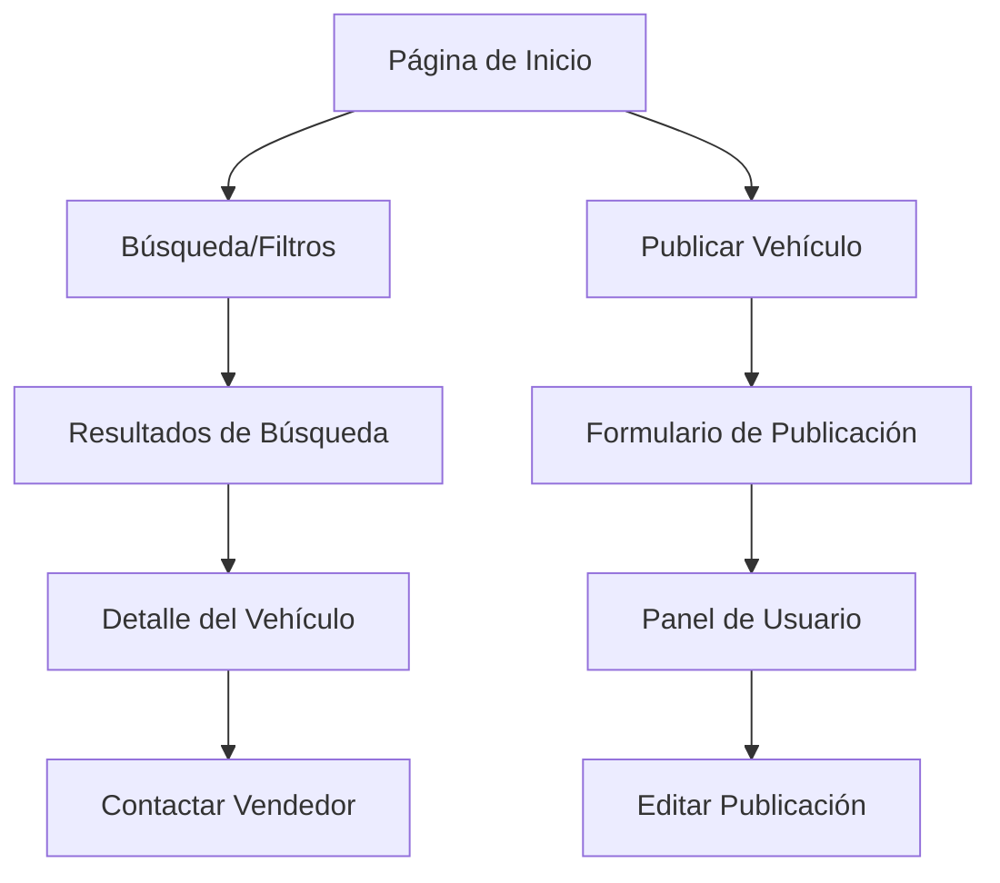

## 1. Product Overview
Sistema web para publicación de vehículos usados que permite a los usuarios vender sus autos publicando información detallada en línea.
- Resuelve el problema de visibilidad para vendedores particulares de autos usados
- Facilita la conexión entre vendedores y compradores potenciales en un solo lugar
- Valor de mercado: plataforma especializada en vehículos usados con enfoque SEO para máxima visibilidad

## 2. Core Features

### 2.1 User Roles
| Role | Registration Method | Core Permissions |
|------|---------------------|------------------|
| Vendedor | Email registration | Publicar vehículos, editar/eliminar sus publicaciones, gestionar contactos |
| Comprador | Email registration | Buscar vehículos, filtrar por criterios, contactar vendedores |
| Visitante | No registration | Ver publicaciones, búsqueda básica |

### 2.2 Feature Module
Nuestro sistema de vehículos usados consta de las siguientes páginas principales:
1. **Página de inicio**: búsqueda principal, filtros destacados, vehículos recientes
2. **Página de publicación**: formulario de datos del vehículo, carga de imágenes, precio
3. **Página de detalle**: información completa del vehículo, galería de imágenes, contacto
4. **Página de búsqueda**: resultados filtrados, ordenamiento, paginación
5. **Panel de usuario**: mis publicaciones, editar/eliminar, estadísticas

### 2.3 Page Details
| Page Name | Module Name | Feature description |
|-----------|-------------|---------------------|
| Página de inicio | Hero section | Búsqueda por marca/modelo con autocompletado, botones de acción rápida |
| Página de inicio | Filtros destacados | Cards con categorías populares (precio, marca, año) con enlaces directos |
| Página de inicio | Vehículos recientes | Grid responsive con miniaturas, precio y datos principales |
| Página de publicación | Formulario de datos | Campos: marca, modelo, año, kilometraje, precio, estado, descripción |
| Página de publicación | Carga de imágenes | Drag & drop para hasta 10 imágenes, previsualización, compresión automática |
| Página de publicación | Información de contacto | Nombre, teléfono, email, ubicación con geolocalización opcional |
| Página de detalle | Galería de imágenes | Carrusel principal, thumbnails navegables, vista ampliada |
| Página de detalle | Ficha técnica | Tabla con especificaciones completas, badges de características |
| Página de detalle | Contacto del vendedor | Formulario de contacto, botón de WhatsApp, teléfono visible |
| Página de búsqueda | Filtros avanzados | Sidebar con múltiples filtros: precio, año, marca, modelo, ubicación |
| Página de búsqueda | Resultados | Grid adaptativo con tarjetas informativas, ordenamiento por relevancia/precio/año |
| Panel de usuario | Mis publicaciones | Tabla con estado de publicación, fecha, visitas, acciones de editar/eliminar |

## 3. Core Process
**Flujo del Vendedor**: El usuario accede al sitio → Se registra con email → Completa el formulario de publicación con datos del vehículo → Sube imágenes → Define precio y contacto → Publicación queda activa → Puede editar o eliminar desde su panel

**Flujo del Comprador**: Usuario accede al sitio → Utiliza búsqueda o filtros → Explora resultados → Click en vehículo de interés → Ve detalles completos → Contacta al vendedor → Negocia directamente

## 4. User Interface Design

### 4.1 Design Style
- **Colores primarios**: Azul oscuro (#1e40af) para headers y CTAs
- **Colores secundarios**: Gris claro (#f3f4f6) para fondos, Verde (#10b981) para éxito
- **Botones**: Estilo rounded-lg con sombras sutiles, hover effects
- **Tipografía**: Inter para headers, system-ui para body text
- **Tamaños**: Headers 24-32px, body 16px, small text 14px
- **Layout**: Card-based con grid responsive, navegación superior sticky
- **Iconos**: Heroicons outline para consistencia

### 4.2 Page Design Overview
| Page Name | Module Name | UI Elements |
|-----------|-------------|-------------|
| Página de inicio | Hero section | Search bar prominente con fondo gradiente, overlay oscuro para legibilidad |
| Página de inicio | Cards de filtros | Iconos grandes, colores de marca, hover scale effect |
| Página de publicación | Formulario | Inputs con bordes redondeados, labels flotantes, validación en tiempo real |
| Página de detalle | Galería | Image ratio 16:9, navegación por thumbnails, fullscreen option |
| Panel de usuario | Tabla | Zebra striping, status badges color-coded, acciones con iconos |

### 4.3 Responsiveness
- Desktop-first approach con breakpoints en 768px y 1024px
- Mobile: Menú hamburger, cards apilados verticalmente, formularios en columna única
- Touch optimization: Botones mínimo 44px, swipe en galerías, teléfonos click-to-call